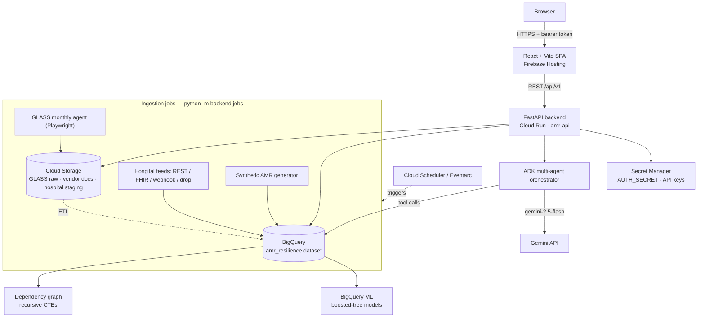
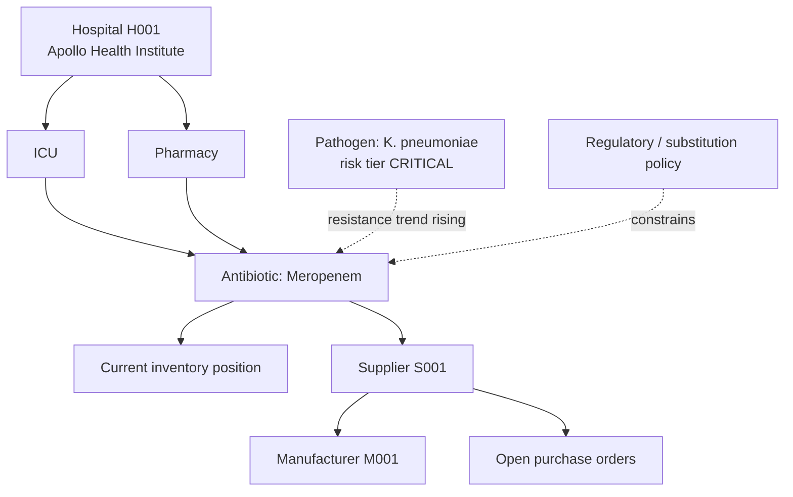
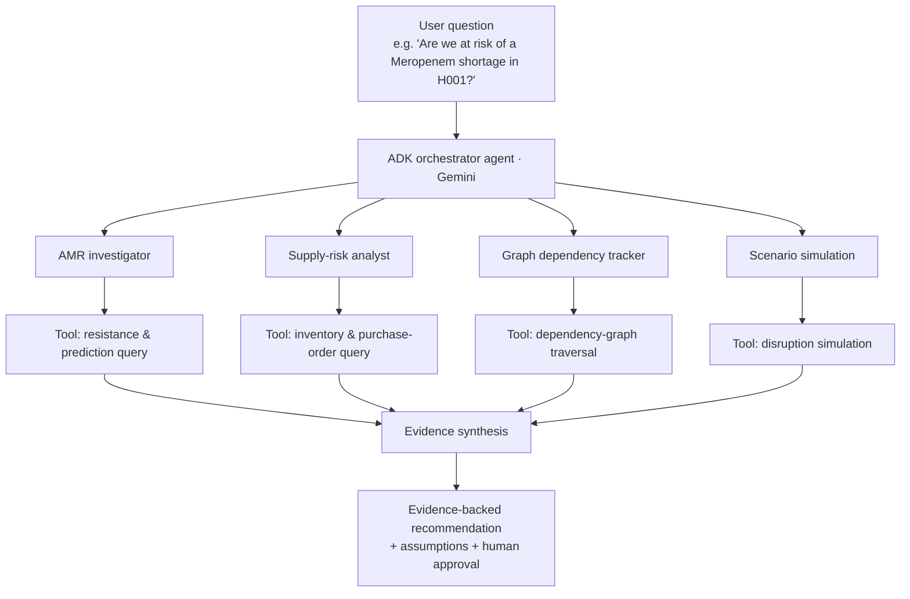

<div align="center">

# 🧬 AMR Resilience Chain

### Decision intelligence for antimicrobial resistance & antibiotic supply-chain resilience

**"82% in stock" doesn't mean "82% resilient."**
This platform connects the two numbers that usually never meet.

[](https://amr-resilience.web.app)
[](https://amr-api-39499444372.us-central1.run.app/health)
[](#-architecture)
[](LICENSE)

[**🚀 Live Demo**](https://amr-resilience.web.app) · [**📄 Documentation**](https://docs.google.com/document/d/1sr4NEQUijg8hHDAZ4BaQYFwx6Lk0SFcl/edit) · [**🧭 Deployment Guide**](deploy/DEPLOYMENT.md)

</div>

---

## The problem, in one sentence

A hospital's antibiotic dashboard can say **"82% in stock"** while resistance to that drug is climbing, its only supplier is slipping on lead times, and a peer hospital is drawing from the same source — and none of that shows up in the 82%.

**AMR Resilience Chain** closes that gap. It connects resistance surveillance, antibiotic usage, hospital inventory, and supplier-network data into one **resilience graph**, then layers on BigQuery ML forecasting, a Gemini-powered multi-agent investigator, and scenario simulation — with a human approving every consequential action.

It is **not** a chatbot, **not** an autonomous prescribing system, and **not** a diagnosis tool. It's decision infrastructure, built to keep a person accountable for every recommendation it makes.

---

## 📚 Table of Contents

- [The problem](#the-problem-in-one-sentence)
- [Key features](#-key-features)
- [Architecture](#-architecture)
- [The resilience graph](#-the-resilience-graph)
- [Multi-agent investigation](#-multi-agent-investigation)
- [Tech stack](#-tech-stack)
- [Live demo](#-live-demo)
- [Getting started locally](#-getting-started-locally)
- [Data model](#-data-model)
- [Project status](#-project-status)
- [Roadmap](#-roadmap)
- [Limitations & honesty notes](#️-limitations--honesty-notes)
- [License](#-license)

---

## ✨ Key Features

| | |
|---|---|
| 🔬 **AMR intelligence** | Resistance trends by pathogen × antibiotic, MIC₅₀/MIC₉₀, risk-tier classification, isolate-level explorer |
| 📦 **Inventory intelligence** | Stock position, consumption rate, projected demand and stockout probability — expressed as **days of cover**, not just a snapshot % |
| 🔗 **Supply-chain intelligence** | Supplier & manufacturer dependency mapping, purchase-order lead times, failover-supplier alerts, concentration risk |
| 🕸️ **Resilience graph** | Hospitals, departments, antibiotics, pathogens and suppliers modelled as one connected graph, traversed with BigQuery **recursive CTEs** |
| 🤖 **Multi-agent investigation** | Gemini + Google ADK orchestrator routes each question to specialist agents (AMR, supply-risk, dependency, simulation), each grounded in real BigQuery tool calls |
| 📈 **BigQuery ML forecasting** | Boosted-tree models for demand forecast, 30-day stockout probability and resistance-trend projection |
| 🧪 **Scenario simulation** | Demand-surge, supplier-delay and combined-crisis stress tests, computed against the live BigQuery snapshot |
| 🔐 **Human-in-the-loop governance** | Regulatory policy engine gates every issue; consequential actions require approval and land in an immutable audit trail |
| 🏷 **Barcode lookup** | Point-of-dispense scan resolves to stock, department allocation, batch and regulatory status |
| 📄 **Vendor document intelligence** | Contract / invoice ingestion, metadata extraction (heuristic or Document AI), validate → approve workflow with append-only history |
| 🛰 **Automated ingestion** | Monthly WHO GLASS browser agent + continuous hospital feeds (REST / FHIR / webhook / bucket-drop) with automatic PII/PHI stripping |
| 👥 **Role-based access** | Per-role experience for Administrator, Chief Pharmacist, Attending Physician, Pharmacist and Department Staff — enforced server-side |

---

## 🏗 Architecture



- **Frontend** — `frontend/`, React 19 + Vite + Tailwind CSS v4 + Recharts, plain hooks, one central API client (`src/api/`). Served as a static build on Firebase Hosting.
- **Backend** — `backend/`, a single FastAPI app, `/api/v1/*`, consistent `{success, data}` / `{success, error}` envelope. Every data access goes through `backend/database/bigquery_client.py`.
- **Auth** — username/password (PBKDF2-SHA256) → HMAC-signed bearer token, 8-hour TTL. Role-based access and the regulatory policy engine are enforced on the server for every request. Login is rate-limited.
- **AI** — `backend/agents/`: an ADK/Gemini orchestrator plus specialist sub-agents, each backed by a concrete BigQuery query rather than free-floating text.
- **Deployment** — Cloud Run (API) + Firebase Hosting (SPA) + Secret Manager. Ingestion is packaged as Cloud Run Jobs with Cloud Scheduler / Eventarc configs (see [`deploy/`](deploy/)).

---

## 🕸 The Resilience Graph

The graph is what makes the core question answerable: *"if Supplier S001 fails for 30 days, which hospitals, antibiotics and departments become vulnerable?"* — a traversal, not a manual cross-reference across five systems.



Traversal is implemented with BigQuery `WITH RECURSIVE` — see `trace_upstream_supply_graph()` in `backend/database/bigquery_client.py`.

---

## 🤖 Multi-Agent Investigation



Each specialist agent calls a real function in `backend/agents/*` that queries BigQuery. Every claim the system makes traces back to a query, a graph edge or a simulation run. `POST /api/v1/agents/orchestrate` runs the flow.

---

## 🧰 Tech Stack

<div align="center">


</div>

| Layer | Technology |
|---|---|
| **Frontend** | React 19, Vite, Tailwind CSS v4, Recharts, React Router, `html5-qrcode` — Firebase Hosting |
| **Backend** | Python 3.13, FastAPI + Uvicorn, single app, REST `/api/v1` — Cloud Run |
| **AI agents** | Google Agent Development Kit (`google-adk`) + `google-genai`, Gemini (`gemini-2.5-flash`) orchestrator + specialist sub-agents grounded in BigQuery tool calls |
| **Forecasting** | BigQuery ML — boosted-tree models: demand forecast, 30-day stockout probability, resistance-trend projection |
| **Data warehouse** | Google BigQuery (`amr_resilience`, US) — governed tables + `WITH RECURSIVE` dependency-graph traversal |
| **Storage** | Cloud Storage — GLASS raw drops, vendor documents, hospital staging |
| **Ingestion** | Playwright browser agent (WHO GLASS), hospital REST / FHIR / webhook / bucket-drop feeds, automatic PII/PHI stripping, synthetic-data generator — Cloud Run Jobs + Cloud Scheduler + Eventarc |
| **Auth & secrets** | PBKDF2-SHA256 password hashing + HMAC-signed bearer tokens, server-side RBAC, rate-limited login — Secret Manager |
| **Doc extraction** | Heuristic regex parser (default) + optional Google Document AI (`DOC_AI_PROCESSOR`) |
| **Infra / CI** | Docker, Cloud Run, Firebase Hosting; `gcloud` + Firebase CLI deploys |

---

## 🚀 Live Demo

| | |
|---|---|
| **Web app** | https://amr-resilience.web.app |
| **API** | https://amr-api-39499444372.us-central1.run.app |
| **API health check** | https://amr-api-39499444372.us-central1.run.app/health |

> First load after idle time may take ~5–10 s (Cloud Run cold start).

### Demo accounts

| Username | Password | Role | Access |
|---|---|---|---|
| `admin` | `admin2026` | Administrator | Everything, incl. Administration |
| `e.vance` | `pharm2026` | Chief Pharmacist | Everything, incl. Administration |
| `s.rao` | `icu2026` | Attending Physician | Operations + Resilience tools |
| `a.khan` | `pharm2026` | Pharmacist | Operations + Resilience tools |
| `j.mehta` | `ward2026` | Department Staff | Operations (most restricted) |

**Try this first:** sign in as `admin`, open **AMR Explorer**, click the *Klebsiella pneumoniae × Meropenem* cell, then jump to **Supply Chain** for the same antibiotic — that's the "two systems, one picture" moment the whole project is built around. Then try **Scenarios Lab → Sepsis outbreak → Run**.

---

## 🛠 Getting Started Locally

**Prerequisites:** Python 3.13, Node 20+, a Google Cloud project with the `amr_resilience` BigQuery dataset, and application-default credentials (`gcloud auth application-default login`).

```bash
git clone https://github.com/shuva-shree/amr-resilience-chain.git
cd amr-resilience-chain
```

### Backend

```bash
python3.13 -m venv .venv
.venv/bin/pip install -r requirements.txt

cp backend/.env.production.example backend/.env      # then fill in the values
# key vars: AUTH_SECRET, GCP_PROJECT, BQ_DATASET_ID, ALLOW_HEADER_AUTH=false

.venv/bin/python -m backend.database.migrate --seed  # create tables + demo data (one-time)
.venv/bin/python -m uvicorn backend.main:app --port 8000
```

### Frontend

```bash
cd frontend
npm install
npm run dev        # http://localhost:5173  (proxies /api → :8000)
```

### Deploy

Full step-by-step guide (beginner-friendly): **[`deploy/DEPLOYMENT.md`](deploy/DEPLOYMENT.md)**.

```bash
gcloud run deploy amr-api --source . --region us-central1        # backend
cd frontend && npm run build && firebase deploy --only hosting   # frontend
```

---

## 📊 Data Model

All entities live in one governed BigQuery dataset, `amr_resilience`, designed so new entities can be added without changing the core architecture:

`hospitals` · `departments` · `pathogens` · `antibiotics` · `amr_observations` · `amr_isolates` · `antibiotic_use` · `antibiotic_inventory` · `supplier_antibiotics` · `suppliers` · `supply_nodes` · `supply_edges` · `purchase_orders` · `medicine_regulatory_policies` · `medicine_barcodes` · `department_allocations` · `inventory_transactions` · `audit_events` · `data_quality_results` · `hospital_users` · `glass_amr_observations` · `glass_ingestion_runs` · `hospital_ingestion_batches` · `vendor_documents` · `vendor_document_events`

Plus BigQuery ML models (`model_demand_forecaster`, `model_stockout_predictor`, `model_amr_trend`) and views that feed the dashboards (`v_live_agent_predictions`, `v_amr_usage_trends`, `v_amr_isolate_resistance_monthly`, `v_resilience_failover_alerts`, …).

---

## 📍 Project Status

| Capability | Status |
|---|:---:|
| BigQuery AMR / resilience data model | ✅ Implemented |
| Hospital inventory & department allocation | ✅ Implemented |
| AMR intelligence + isolate-level explorer | ✅ Implemented |
| Resilience / dependency graph (recursive CTEs) | ✅ Implemented |
| BigQuery ML forecasting (boosted trees) | ✅ Implemented |
| ADK multi-agent investigation | ✅ Implemented |
| Scenario simulation | ✅ Implemented |
| Regulatory policy engine + audit trail | ✅ Implemented |
| Barcode medicine lookup | ✅ Implemented |
| Staff account management + RBAC | ✅ Implemented |
| Hospital ingestion (REST / FHIR / webhook / bucket-drop) + PII stripping | ✅ Implemented |
| WHO GLASS browser agent + ETL | 🟡 Implemented; the AMR portal view exports images, so real GLASS rows need a CSV drop |
| Vendor document intelligence | 🟡 Heuristic extraction; Document AI optional |
| Scheduled ingestion jobs (Cloud Scheduler / Eventarc) | 🟠 Configs provided, not applied |
| Multi-hospital network | 🟠 Roadmap |
| One Health expansion | 🔵 Future |

---

## 🗺 Roadmap

- [ ] Apply the Cloud Scheduler / Eventarc wiring so GLASS + bucket ingestion run unattended
- [ ] Extend from single-hospital to a multi-hospital network view
- [ ] Wire in Google Document AI for structured vendor-contract extraction
- [ ] Prospective validation of the forecasting models against real outcomes
- [ ] Regional / national resilience rollup dashboard
- [ ] One Health extension (human + animal + environmental AMR data)

---

## ⚠️ Limitations & Honesty Notes

- The demo data is **seeded and synthetically generated**, modelled on realistic AMR and hospital-operations patterns — not sourced from a real hospital yet. Scope is a **single hospital** (`H001`), with historical data on a 2024 calendar.
- Forecasting demonstrates the pipeline end-to-end. **No accuracy figure is claimed** without prospective validation against real outcomes.
- The system does **not** diagnose, prescribe, or autonomously execute procurement. It recommends; a human approves.
- Auth is real (hashed credentials, signed expiring tokens, server-side RBAC, rate-limited login) but a production deployment should move to a managed IdP; `ALLOW_HEADER_AUTH` must stay `false` in production.
- The WHO GLASS agent connects to the live portal and captures artefacts, but that view exports images rather than tabular data — real GLASS rows currently require a CSV dropped into the raw bucket. All screens are fully populated from the seeded + synthetic dataset regardless.

Being upfront about what's still rough is part of the design philosophy here, not an afterthought.

---

## 🙏 Acknowledgments

Built on Google Cloud — BigQuery, BigQuery ML, Cloud Run, Cloud Storage, Secret Manager, the Gemini API and the Agent Development Kit.

## 📄 License

Distributed under the MIT License. See [`LICENSE`](LICENSE).

---

<div align="center">

**AMR is not only about resistance. It is about resilience.**

[Live App](https://amr-resilience.web.app) · [Documentation](https://docs.google.com/document/d/1sr4NEQUijg8hHDAZ4BaQYFwx6Lk0SFcl/edit) · [Deployment Guide](deploy/DEPLOYMENT.md)

</div>
